 

---

## `01 // SYSTEM PROFILE`

> **STATUS:** `ONLINE`  
> **ROLE:** `IT STUDENT`  
> **ENVIRONMENT:** `IFPA`  
> **FOCUS:** `SOFTWARE DEVELOPMENT`

### 👩‍💻 Sobre mim

- 🎓 Estudante do **3º ano do Ensino Médio Integrado ao Técnico em Informática no IFPA**.
- 💻 Tenho interesse em **tecnologia e desenvolvimento de software**.
- 🌱 Atualmente estou **aprendendo, praticando e desenvolvendo projetos** na área de TI.
- 🧩 Utilizo este espaço para **registrar meus projetos e acompanhar minha evolução**.
- 🚀 Meu objetivo é **crescer profissionalmente e continuar aprendendo na área de tecnologia**.

---

## `02 // TOOLS & TECHNOLOGIES`

---

---

## `03 // CURRENT OBJECTIVES`

<pre>
evillyn@github:~$ cat current_goals.txt

&gt; Construir meu portfólio
&gt; Aprimorar Git &amp; GitHub
&gt; Evoluir em programação
&gt; Desenvolver novos projetos
&gt; Explorar novas tecnologias
&gt; Crescer na área de TI

evillyn@github:~$ echo "KEEP LEARNING. KEEP BUILDING."

KEEP LEARNING. KEEP BUILDING.
</pre>

---

## `04 // GITHUB ANALYTICS`

## `05 // CONTRIBUTION STREAK`

---

## `06 // ACTIVITY GRAPH`

---
## `07 // LITTLE ACHIEVEMENTS` 🌷

♡ **Learning** → GitHub  
♡ **Building** → My professional portfolio  
♡ **Exploring** → New technologies  
♡ **Growing** → Programming skills
## `08 // GAME OVER` 🎀

╭──────────────────────────────╮
│                              │
│        ♡ GAME OVER ♡         │  
│                              │
│   ✦  THANKS FOR PLAYING  ✦  │
│                              │
│          ₍ᐢ. .ᐢ₎              │
│          / >♡ <\             │
│                              │
╰──────────────────────────────╯

## `09 // CONNECT` 🎀

  

♡ <b>LET'S CONNECT</b> ♡

 

Keep learning · Keep building · Keep growing 🌷

---
